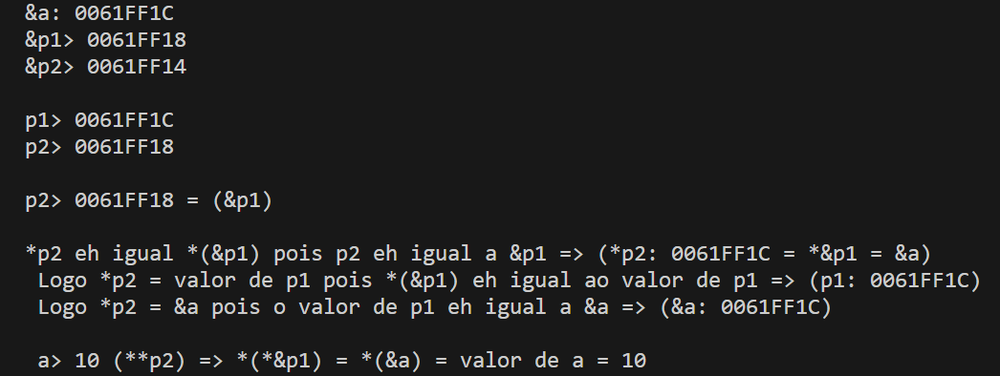

# Ponteiros

Um ponteiro é um tipo de dado que armazena um endereço de memória de uma outra variável. 

Toda ponteiro, (i.e, endereço de memória) ocupa 8 Bytes de memória, ao menos nas arquiteturas mais atuais de computadores.

Declaramos variáveis ponteiros utilizando asteriscos (*).

No exemplo abaixo, podemos observar uma variável do tipo ponteiro que aponta para um inteiro:

**Código:**
```
#include <stdio.h>

int main() {

    int *primeiroPonteiro = NULL;

    printf("> %d\n", primeiroPonteiro); //Saída no tipo inteiro
    printf("> %p", primeiroPonteiro); //Saída no tipo ponteiro

    return 0;
}
```

**Saída:**


## Ponteiros, identificadores, referências e valores

Ponteiros armazenam referências de memória de outras variáveis, porém podemos manipular os valores armazenados nessas referências armazenadas pelos ponteiros.

Conseguimos isso utilizando asteriscos (*) quando chamamos a variável ponteiro. Observe o exemplo abaixo:

**Código:**
```
#include <stdio.h>

int main() {

    int a = 10;

    int *p1 = &a; //Armazena o endereço de memória da variável a

    //Imprime o local na memória da variável 'a' em hexadecimal
    printf("p1 > %p (Referencia de memoria da variavel 'a' em hexadecimal)\n", p1);
    
    //Imprime o local na memória da variável 'a' em hexadecimal 
    printf("p1 > %d (Referencia de memoria da variavel 'a' em decimal)\n", p1);
    
    printf("\n");

    //Valor armazenado na referencia de memória que 'p1' armazena, ou seja, a referência de 'a'
    printf("*p1 > %d (Valor armazenado na referencia de memoria que 'p1' armazena, ou seja, valor armazenado em 'a')", *p1); 

    return 0;
}
```

**Saída:**


## Ponteiro de Ponteiros

Podemos criar variáveis que apontam para uma variável que também é um ponteiro, criando assim um ponteiro de ponteiros.

Logo, um ponteiro de ponteiros é uma variável que possui como valor o endereço de memória de uma variável que também é um ponteiro.

Declaramos uma variável ponteiro de ponteiros utilizando dois asteríscos (**), observe o cógido exemplo abaixo:

**Código:**
```
#include <stdio.h>

int main() {

    int a = 10;

    int *p1 = &a;
    
    int **p2 = &p1; //p2 eh um ponteiro de ponteiros

    printf("&a: %p\n", &a);
    printf("&p1> %p\n", &p1);
    printf("&p2> %p\n\n", &p2);

    printf("p1> %p\n", p1);
    printf("p2> %p\n\n", p2);

    //======================================================================

    printf("p2> %p = (&p1) \n\n");

    printf("*p2 eh igual *(&p1) pois p2 eh igual a &p1 => (*p2: %p = *&p1 = &a)\n ", *p2); 
    printf("Logo *p2 = valor de p1 pois *(&p1) eh igual ao valor de p1 => (p1: %p)\n ", p1);
    printf("Logo *p2 = &a pois o valor de p1 eh igual a &a => (&a: %p)", &a);

    //======================================================================

    printf("\n\n a> %d (**p2) => *(*&p1) = *(&a) = valor de a = 10", **p2);

    return 0;
}
```

**Saída:**

